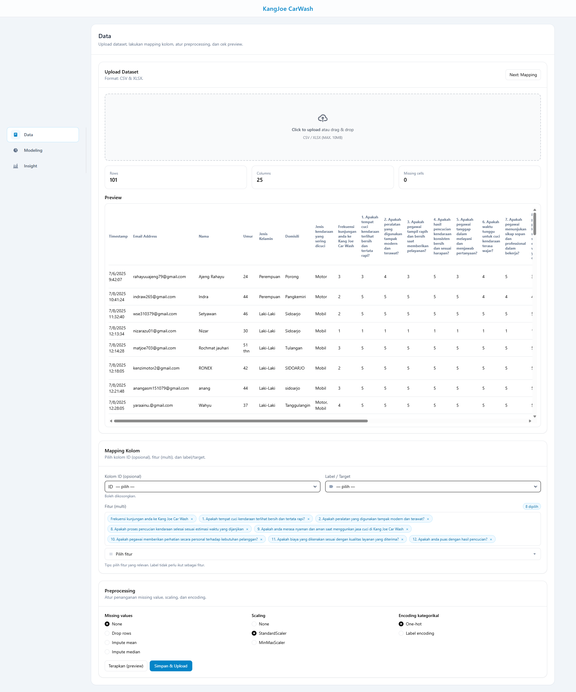
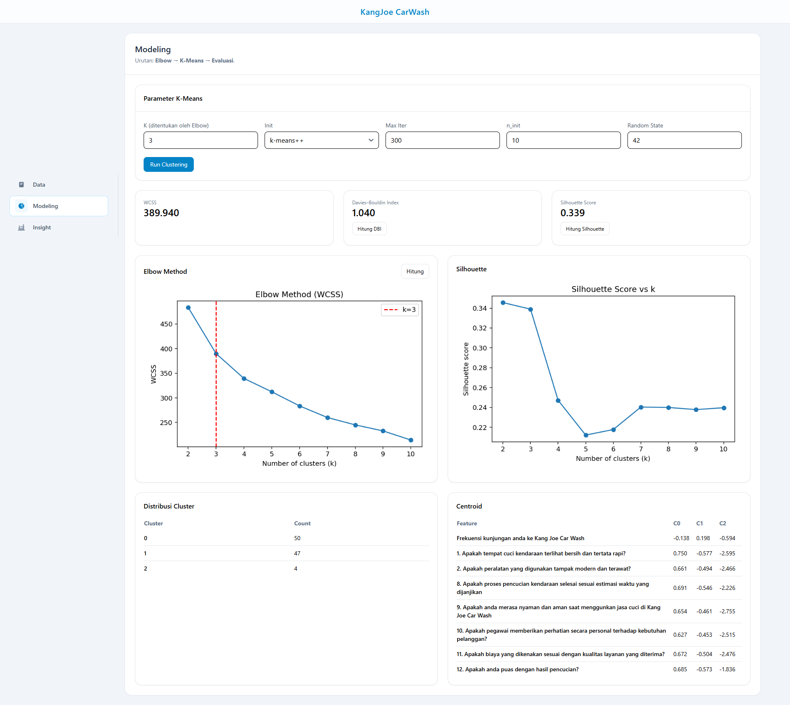
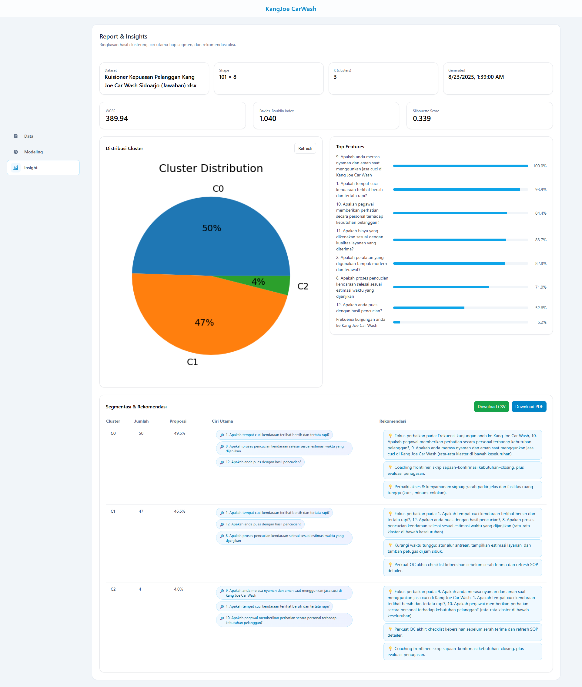

<p align="center">
	
</p>

<h1 align="center">CarWash Analytics — Segmentasi Pelanggan Berbasis K‑Means</h1>

<p align="center">
	Dibangun oleh <b>Laita Zidan</b>. Aplikasi ini mengintegrasikan upload & preprocessing data, penentuan K (Elbow),
	pelatihan K‑Means, evaluasi (DBI & Silhouette), serta pembuatan laporan PDF/CSV untuk mendukung keputusan operasional.
</p>

---

## 🎯 Tujuan Sistem

- Menghasilkan segmentasi pelanggan yang dapat ditindaklanjuti dari data survei/operasional
- Menentukan jumlah cluster yang sesuai menggunakan metode Elbow dan kurva Silhouette
- Menyediakan ringkasan hasil (centroid, distribusi cluster, metrik) yang mudah dipahami
- Menghasilkan laporan siap unduh (PDF/CSV) beserta rekomendasi tindakan per segmen

---

## 🧠 Teknologi yang Digunakan

| Komponen               | Fungsi                                                       |
| ---------------------- | ------------------------------------------------------------ |
| Flask + CORS           | Backend REST API: upload, preprocessing, modeling, reporting |
| NumPy, Pandas          | Pemrosesan data tabular                                      |
| scikit-learn           | K‑Means, Silhouette, DBI                                     |
| matplotlib             | Visualisasi (Elbow, Silhouette, Pie distribusi) → base64     |
| kneed                  | Heuristik deteksi siku (KneeLocator) untuk Elbow             |
| openpyxl               | Baca file Excel (XLSX) di backend                            |
| reportlab              | Generate PDF ringkas hasil clustering                        |
| Vite + Vanilla JS      | Frontend SPA                                                 |
| TailwindCSS + Flowbite | Gaya UI dan komponen                                         |
| In‑memory state        | Penyimpanan state sederhana selama sesi dev                  |

---

## 🧩 Struktur Direktori

```
CarWash-Analytics-App/
├── backend/
│   ├── app.py               # Bootstrap Flask + CORS + register blueprints
│   ├── config.py            # Path data (uploads/outputs)
│   ├── requirements.txt     # Dependensi backend
│   ├── api/
│   │   ├── data_routes.py   # /api/upload → simpan file, mapping, preprocessing
│   │   ├── model_routes.py  # /api/model/* → elbow, train, dbi, silhouette
│   │   └── report_routes.py # /api/report/* → summary & download report (pdf/csv)
│   ├── services/
│   │   ├── io_utils.py      # baca csv/xlsx, simpan upload
│   │   ├── prep_utils.py    # imputasi, encoding, scaling
│   │   ├── model_utils.py   # elbow, kmeans, metrik & util table
│   │   ├── viz_utils.py     # helper plot b64 (elbow/pie)
│   │   └── report_utils.py  # penamaan fitur, rekomendasi, builder PDF
│   └── store/state.py       # state sementara aplikasi
│
├── frontend/
│   ├── index.html           # Shell SPA + sidebar
│   ├── package.json         # Vite dev/build scripts
│   ├── vite.config.js       # Dev server & proxy /api → 127.0.0.1:5000
│   └── src/
│       ├── css/index.css    # Tailwind + Flowbite
│       └── js/
│           ├── main.js      # Router SPA sederhana
│           └── pages/
│               ├── data.js      # Upload, mapping, preprocessing → /api/upload
│               ├── modeling.js  # Elbow, train, metrik, tabel hasil
│               └── insights.js  # Ringkasan, distribusi cluster, top features, download
│
└── docs/
		└── screenshots/         # Tempat gambar showcase README (hero, 01-data, 02-modeling, 03-insights)
```

---

## 🔄 Alur Sistem

1. Upload & Mapping Data (CSV/XLSX) → pilih kolom fitur, opsi preprocessing (missing/encoding/scaling)

2. Elbow Method → tentukan K (disertai grafik WCSS) dan opsional kurva Silhouette

3. K‑Means Training → dapatkan labels, centroid per fitur, WCSS, serta opsional silhouette score

4. Insights → ringkasan dataset, distribusi cluster (pie), fitur paling membedakan, rekomendasi tindakan

5. Report → unduh PDF/CSV ringkasan hasil clustering

---

## 🚀 Cara Menjalankan (Windows PowerShell)

Backend:

```powershell
cd d:\Project\CarWash-Analytics-App\backend
python -m venv .venv
.\.venv\Scripts\Activate.ps1
pip install -r requirements.txt
python app.py
```

Frontend (terminal lain):

```powershell
cd d:\Project\CarWash-Analytics-App\frontend
npm install
npm run dev
```

---

## 🖼️ Screenshot

🔗 Halaman Data

<p align="center">
	
</p>

🔗 Halaman Modeling

<p align="center">
	
</p>

🔗 Halaman Insights

<p align="center">
	
</p>

---

## 👮 Role & Akses

| Role     | Fitur Utama                                                                 |
| -------- | --------------------------------------------------------------------------- |
| Operator | Upload & mapping data, jalankan Elbow/K‑Means, lihat insights, unduh report |

---

## 📜 Lisensi

&copy; 2025 Laita Zidan Dirilis dengan [Lisensi MIT](LICENSE)
---

## 🙋 Tentang Pengembang

**Laita Zidan**  
GitHub: [github.com/elzidanecodes](https://github.com/elzidanecodes)
